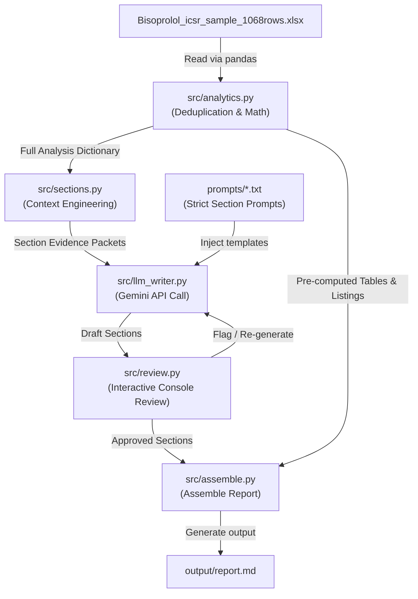

# System Architecture & Data Flow

This document describes the architectural components and data flow of the grounded Periodic Safety Report (PADER) generation pipeline.

## Component Overview

The system is decomposed into distinct, decoupled components to ensure that mathematics remains entirely deterministic (Python/pandas) and the LLM is restricted to prose writing based on ground truth data.

1. **CLI Entrypoint (`main.py`)**: Wires the pipeline, loads credentials, compiles the LangGraph workflow, and initiates execution.
2. **Deterministic Analytics (`src/analytics.py`)**: A pandas-only engine that performs all validation, deduplication, bucketing, and math calculations on the source Excel dataset.
3. **Context Engineering (`src/sections.py`)**: Assembles minimal, section-specific JSON "evidence packets" from the raw analysis results.
4. **Strict Prompts (`prompts/`)**: Section-specific prompt templates that enforce a neutral regulatory tone and forbid numerical extrapolation.
5. **LLM Writer (`src/llm_writer.py`)**: A wrapper around the Gemini API that merges prompts with evidence packets to draft prose.
6. **Human-in-the-Loop Review (`src/review.py`)**: An interactive console interface allowing human reviewers to approve or flag (with feedback) each generated section.
7. **Graph Orchestrator (`src/graph.py`)**: A LangGraph state machine orchestrating nodes and conditional routing loops.
8. **Assembly Engine (`src/assemble.py`)**: Combines approved prose sections and pre-computed data tabulations/listings into a structured Markdown document.

---

## Data Flow Diagram

The following Mermaid diagram visualizes the data flow and orchestration cycles:

---

## Key Design Principles

- **No Raw Data to LLM**: The LLM never sees the raw CSV/Excel spreadsheet. It only sees a tiny scoped JSON summary per section.
- **Math Isolation**: The LLM is never asked to add, count, average, or calculate percentages. Every digit in the text originates from Python.
- **Interactivity**: The LangGraph state machine blocks execution for human review, allowing manual feedback to override and trigger section regeneration.
- **Auditable Lineage**: Every number presented in the final report can be mapped directly back to the output of `src/analytics.py`.
